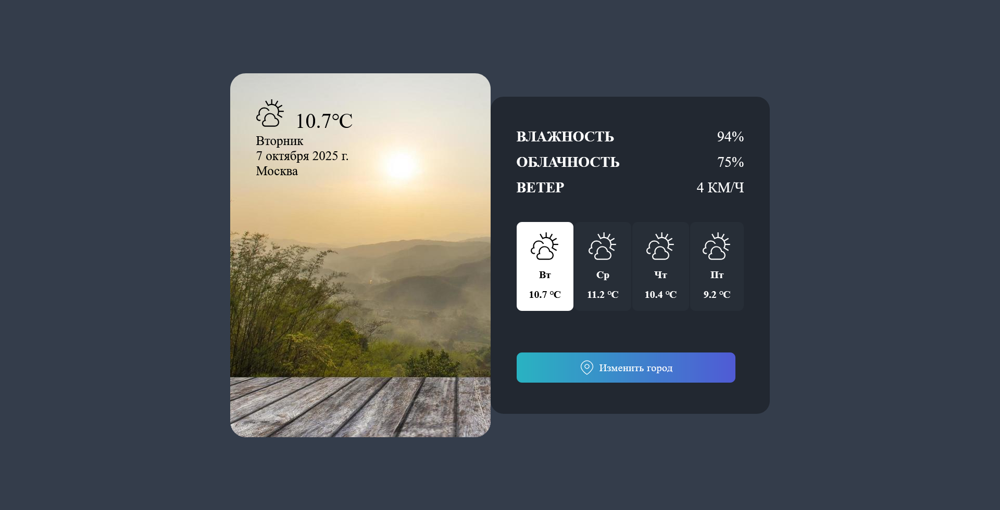

## 🤸 Demo

Git it a go [here](https://simple-weather-app-tau.vercel.app/) :)

   
    
   
  
  

    
    
    
  

<h1 align="center">Weather Forecast Mini App</h1> 

## 📖 About

This is a small Vue-based application that displays a **4-day weather forecast** for a selected city.  
Weather data is fetched from [weatherapi.com](https://www.weatherapi.com/).

## 🛠️ Features & Techniques Used

- **Vue Directives**: `v-on`, `v-bind`, `v-for`, `v-if`, `v-show`, `v-model`
- **Slots**
- **Reactivity & Lifecycle**:
  - `computed` properties
  - `ref` for reactive state
  - Lifecycle hooks: `onMounted`, `onUpdated`
  - `emits` for parent-child communication
- **Custom Directive**: focus directive applied to the city input on mount
- **Dependency Injection**: `provide/inject` usage for sharing state between components

## ⚠️ Known Issues

- Responsivenes is currently NOT supported
- Only the "invalid city" error is currently handled
- Small **CLS (Cumulative Layout Shift)** when selecting a new city
- When focusing the input and pressing **Enter**, the city is immediately applied instead of staying focused
  - (With **Space** the behavior works correctly)
- In the sidebar, the displayed city name is the typed one, not the normalized name returned by the API
